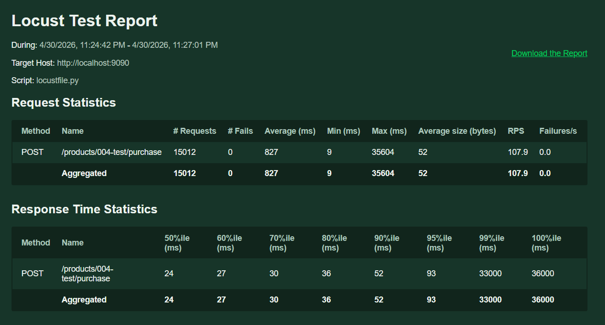
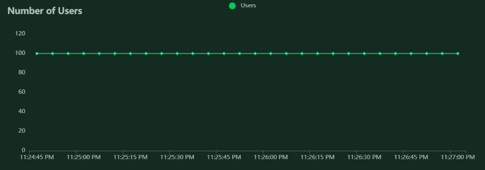
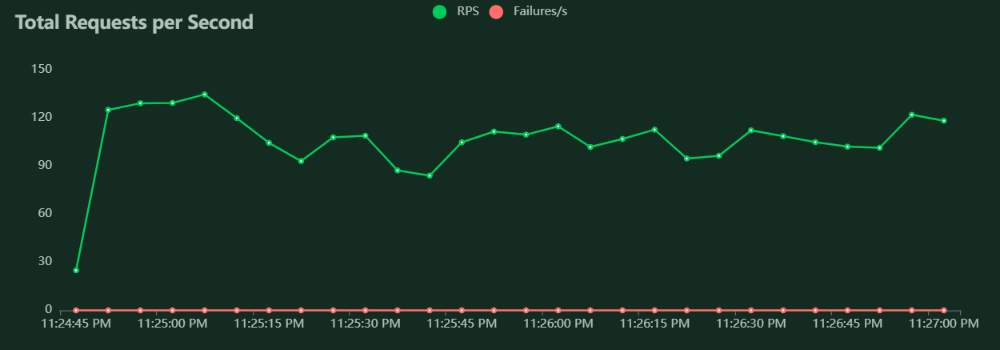
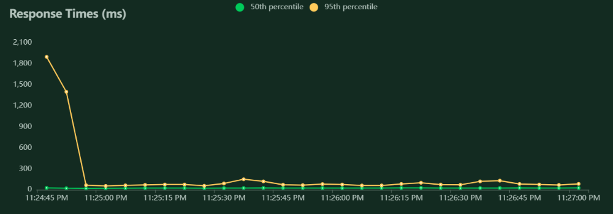

# Inventory Management API

REST API untuk manajemen inventori produk dengan fitur Flash Sale yang tahan terhadap high-concurrency traffic.

## Tech Stack

- **Go** + **Gin** framework
- **PostgreSQL** - primary database
- **Redis** - atomic stock deduction untuk flash sale
- **Native SQL** - sql murni

## Architecture

Clean Architecture dengan 4 layer:

```
domain/          → Entity, interface (Repository, Usecase, Cache)
repository/      → Implementasi akses data (PostgreSQL, Redis)
usecase/         → Business logic
delivery/http/   → HTTP handler & router (Gin)
config/          → Konfigurasi environment
migration/       → Database migration
```

## Cara Menjalankan

### 1. Jalankan PostgreSQL & Redis

```bash
docker-compose up -d
```

### 2. Set Environment Variables (opsional)

Copy `.env.example` dan sesuaikan jika perlu. Default sudah sesuai dengan docker-compose.

### 3. Jalankan Aplikasi

```bash
go run main.go
```

Server berjalan di `http://localhost:8080`. Migration otomatis dijalankan saat startup.

## API Endpoints

| Method | Endpoint                    | Deskripsi              |
|--------|-----------------------------|------------------------|
| POST   | `/products`                 | Buat produk baru       |
| GET    | `/products`                 | List semua produk      |
| GET    | `/products/{sku}`           | Detail produk by SKU   |
| PUT    | `/products/{sku}`           | Update produk          |
| DELETE | `/products/{sku}`           | Hapus produk           |
| POST   | `/products/{sku}/purchase`  | Beli produk (flash sale)|

### Contoh Request

**Create Product:**
```json
POST /products
{
  "sku": "ITEM-001",
  "name": "Laptop Gaming",
  "qty": 100,
  "price": 15000000.00
}
```

**Purchase:**
```json
POST /products/ITEM-001/purchase
{
  "qty": 1
}
```

## Flash Sale Strategy

Masalah: Ribuan request bersamaan bisa menyebabkan database exhaustion dan overselling.

**Solusi: Redis sebagai gatekeeper**

1. **Stock di-cache di Redis** saat produk dibuat/diupdate
2. **Atomic decrement via Lua script** - Redis menjalankan Lua script yang mengecek dan mengurangi stock secara atomic (single-threaded), sehingga tidak mungkin terjadi race condition
3. **Hanya request yang lolos Redis** yang diteruskan ke database
4. **Rollback** jika write ke database gagal

Alur:
```
Request masuk → Redis DECR (atomic) → Jika stock cukup → UPDATE DB
                                     → Jika stock habis → Return 400
```

Dengan pendekatan ini, dari 1000 concurrent request untuk 10 stock, hanya 10 yang sampai ke database. 990 sisanya ditolak di level Redis tanpa menyentuh PostgreSQL.

## Stress Test

Stress test yang digunakan menggunakan locus

- Requet response statistic

- Jumlah User

- Total Request per detik

- Response Time



```

## Keputusan Desain

1. ID menggunakan random uint  - bukan sequence, sesuai requirement
2. SKU sebagai business key  - digunakan di URL path, bukan ID
3. Redis Lua script  - menjamin atomicity tanpa distributed lock
4. CHECK constraint di DB  - `qty >= 0` sebagai safety net terakhir
5. DB `WHERE qty >= $1`  - double protection di level query
